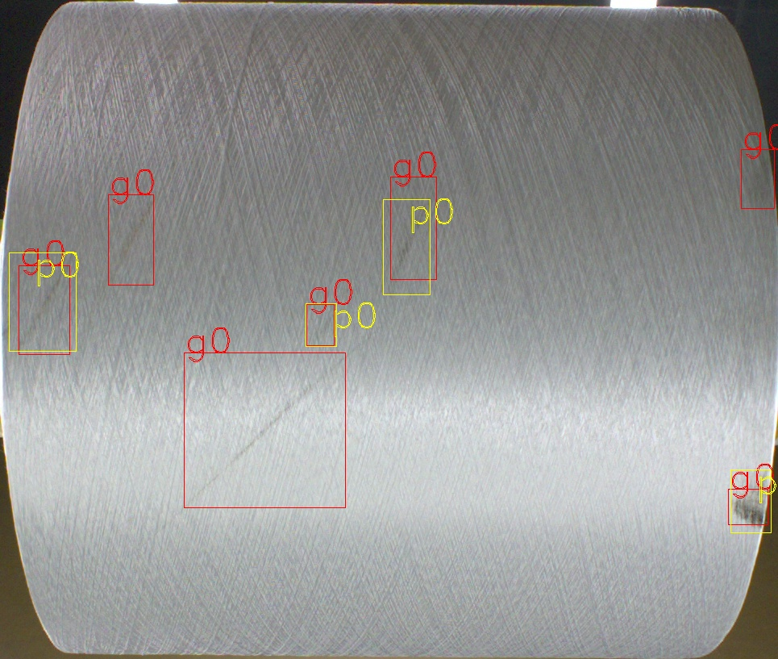

# yolov5_facevisa

| 更新日期   | 更新内容                                   |
| ---------- | ------------------------------------------ |
| 2022-09-01 | 支持加载训练测试平台输入的配置参数         |

一、数据格式转换工具

1.voc2yolo.py: 支持VOC格式数据使用yolo网络训练模型；

2.yolo2voc.py：预测结果转换为voc格式，对接飞升AI平台的voc2json;

二、飞升AI平台输入的网络训练测试配置参数文档

1.alg_params.yaml: 包含网络训练、测试时常规的参数

如：train中epoch、batch_size、img_size，test中conf_thres、iou

三、内部使用的yolov5训练代码

工具一：vis_analysis.py （Facevisa_visAnalysis.sh）对模型的漏检进行可视化分析，会把含有漏检目标的图像按照漏检物体的类别挑选出来的。

如下图，**g0** 表示 标签为0的GT，**p0**表示预测为0的预测结果，下图可以看到3个漏检目标

注意事项， 	iou阈值有两个

- **iou-thres-nms** 用于 NMS阈值
- **iou-thres-pos** 用于和GT对比时，判断prediction的IOU阈值。这个是为了一定程度照顾小目标的检测

工具二：tools/vis_gts.py  对 yolo格式的标注进行可视化，防止制作标签发生错误

